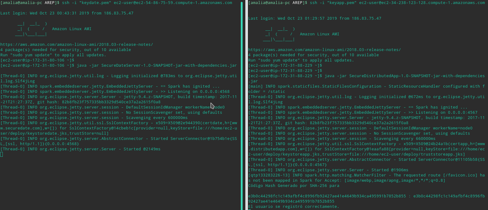

## Aplicación distribuida segura en todos sus frentes

En este repositorio se desarrolló una aplicación segura con autenticación, autorización e integridad de usuarios. Cuando se accede por el browser, se hace de forma segura.  Adicionalmente, hace uso de otra aplicación de la cual usa un servicio que devuelve la fecha. 
Para garantizar autenticación se maneja registro e inicio de sesión de usuarios.
Al registrarse un usuario, la aplicación guarda un código hash de la contraseña, haciendo uso del algoritmo SHA para asegurar integridad. 
Para iniciar sesión, se verifica que la contraseña ingresada, al aplicarle el mismo algoritmo, el resultado es igual al código guardado al registrarse. De esta manera se garantiza la autorización, para que al ingresar a su perfil se verifique que es quien dice ser y pueda ver su información.

Para la segunda parte, se hace uso de un servicio externo, el cual es encuentra en este repositorio: <https://github.com/acai-bjca/SecureDateServer>, y se hace uso de certificados.
Cada aplicación genera su propio certificado y lo almacena en un KeyStore, y la aplicación distribuida que hace uso del servicio externo, contiene un truestore con el certificado del sistema externo en el que confía, es decir la aplicación que le presta el servicio de fecha.

Una  vez se verificó el correcto funcionamiento entre las dos aplicaciones, se desplegaron en AWS.

PAra más detallesdel desarrolo diríajase al archivo: <https://github.com/acai-bjca/SecureDistributedApp/blob/master/Articulo-AWS.pdf>


___
### Uso del proyecto como librería
Si desea usar alguno de los dos repositorios como librería en su proyecto, realice los siguientes pasos:

• Descargue o clone él repositorio
	- SecureDistributedApp: <https://github.com/acai-bjca/SecureDistributedApp.git>
	- SecureDateServer: <https://github.com/acai-bjca/SecureDateServer.git>

• Agregue la respectiva dependencia al pom de su proyecto:
``` xml
 <dependency>
	<groupId>edu.eci</groupId>
    <artifactId>SecureDistributedApp</artifactId>
    <version>1.0-SNAPSHOT</version>
</dependency>
```

``` xml
 <dependency>
	<groupId>edu.eci</groupId>
    <artifactId>SecureDateServer</artifactId>
    <version>1.0-SNAPSHOT</version>
</dependency>
```

• Importe el proyecto en la clase que lo requiera:
import edu.eci.*;
___
### Documentación
La documentación del repositorio la puede encontrar en: <https://github.com/acai-bjca/SecureDistributedApp/tree/master/src/main/resources/documentacion/apidocs>

___
### Pruebas
Acontinuación se muestra la correcta funcionalidad de la aplicaciones desplegadas en AWS:

Ejecución de los archivos .jar

 
SecureDistributedServer- Inicio

 
SecureDistributedServer-Registro


Generación del código hash de la contraseña al registrarse:

 

SecureDistributedServer - Inicio de Sesión

 

Comparación de códigos hash
 
 

SecureDistributedServer – Perfil


SecureDistributedServer - Ceritficado

___
### Construido con

• Java  
• [Maven] (https://maven.apache.org/) - Gestión de dependencias

___
### Autor

**Amalia Inés Alfonso Campuzano** 

Estudiante de la Escuela Colombiana de Ingeniería Julio Garavito

Ingeniería de Sistemas
___
### Licencia

Este proyecto está licenciado bajo la Licencia GNU - vea el archivo [LICENSE.md] (LICENSE.md) para más detalles.

